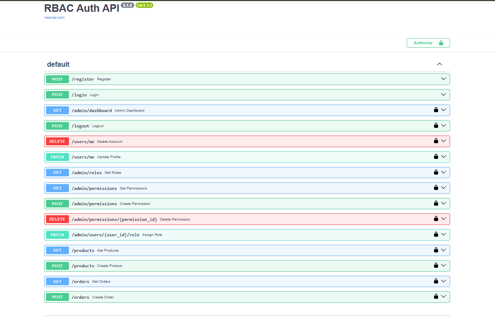

# RBAC Auth API

Backend-приложение с системой аутентификации и авторизации
на основе ролевой модели доступа (RBAC — Role-Based Access Control).

---

## Стек технологий

| Технология        | Версия  | Зачем используется                                      |
|-------------------|---------|---------------------------------------------------------|
| Python            | 3.14   | Основной язык                                           |
| FastAPI           | 0.135   | Web-фреймворк. Роутинг, валидация, dependency injection |
| SQLAlchemy        | 2.0     | ORM. Работа с БД через Python-классы вместо SQL         |
| PostgreSQL        | 18     | Основная база данных                                    |
| psycopg2          | 2.9     | Драйвер соединения Python → PostgreSQL                  |
| Pydantic          | 2.13    | Валидация входящих данных, схемы запросов и ответов     |
| python-jose       | 3.5     | Генерация и проверка JWT токенов                        |
| passlib + bcrypt  | 1.7/3.2 | Хэширование паролей                                     |
| uvicorn           | 0.44    | ASGI-сервер, запускает FastAPI приложение               |

---
## Как запустить

```bash
# 1. Установить зависимости
pip install -r requirements.txt

# 2. Создать БД
createdb auth_db  # или через pgAdmin

# 3. Запустить сервер (таблицы создадутся автоматически)
python main.py

# 4. Заполнить тестовыми данными
python seed.py

# 5. Проверить что всё работает
python test_final.py
```

Документация API доступна по адресу: http://127.0.0.1:8000/docs

---

## Тестовые пользователи

| Email             | Пароль       | Роль    |
|-------------------|--------------|---------|
| admin@test.com    | Admin1234    | admin   |
| manager@test.com  | Manager1234  | manager |
| viewer@test.com   | Viewer1234   | user    |

---
## Как тестировать

### Через Swagger UI (руками)

Открой http://127.0.0.1:8000/docs

1. Вызови `POST /login` — введи email и пароль из таблицы выше
2. Скопируй `access_token` из ответа
3. Нажми кнопку **Authorize** в правом верхнем углу
4. Вставь токен в поле `Value` → нажми **Authorize**
5. Теперь все эндпоинты со значком 🔒 работают с твоим токеном

Попробуй залогиниться под разными пользователями и вызвать
`GET /products` или `POST /orders` — увидишь разницу между 200, 401 и 403.



### Через автоматический тест

Запускает все сценарии сразу и показывает результат:

```bash
python test_final.py
```

## Архитектура проекта

auth-backend/
├── main.py        — точка входа, все HTTP эндпоинты
├── auth.py        — аутентификация: JWT, get_current_user, require_role
├── security.py    — хэширование паролей (отдельно чтобы избежать цикл. импортов)
├── crud.py        — операции с БД: создание, чтение, обновление записей
├── models.py      — SQLAlchemy модели (таблицы БД)
├── schemas.py     — Pydantic схемы (валидация запросов и ответов)
├── database.py    — подключение к БД, сессия
├── config.py      — константы: секреты, настройки JWT
├── seed.py        — заполнение БД тестовыми данными
└── test_final.py  — тесты системы прав

### Зачем так разделено

Каждый файл отвечает ровно за одну вещь — это принцип Single Responsibility.

**`models.py`** знает только как выглядят таблицы в БД. Ничего не знает о HTTP.

**`schemas.py`** знает только как выглядят данные на входе и выходе API. Ничего не знает о БД.

**`crud.py`** знает только как читать и писать в БД. Ничего не знает о HTTP и токенах.

**`auth.py`** знает только как проверить токен и определить пользователя. Не знает о бизнес-логике.

**`main.py`** собирает всё вместе — принимает запрос, вызывает нужные функции, возвращает ответ.

Это означает что если нужно поменять БД — меняешь только `models.py` и `crud.py`. Если меняешь формат токена — только `auth.py`. Остальное не трогаешь.

---

## Схема базы данных

### Таблицы и их назначение

**`users`** — аккаунты пользователей.
Пароль никогда не хранится в открытом виде — только bcrypt-хэш.
`is_deleted` реализует мягкое удаление: запись остаётся в БД,
но пользователь не может войти. Это важно для аудита и истории.

users
├── id            — первичный ключ
├── email         — уникальный, используется для входа
├── first_name    — имя (обязательно)
├── last_name     — фамилия (обязательно)
├── patronymic    — отчество (опционально)
├── hashed_password — bcrypt хэш пароля
├── is_deleted    — мягкое удаление (false по умолчанию)
└── role_id       — внешний ключ на roles

**`roles`** — справочник ролей. Каждый пользователь имеет ровно одну роль.
roles
├── id    — первичный ключ
└── name  — уникальное имя: "admin", "manager", "user"
**`resources`** — что мы защищаем. Каждый бизнес-объект — отдельная запись.
resources
├── id    — первичный ключ
└── name  — "product", "order", "user"

**`actions`** — что можно делать с ресурсами.
actions
├── id    — первичный ключ
└── name  — "read", "create", "update", "delete"

**`permissions`** — сердце системы RBAC.
Одна запись = одно разрешение: роль может выполнить действие над ресурсом.
permissions
├── id          — первичный ключ
├── role_id     — какая роль
├── resource_id — над каким ресурсом
└── action_id   — какое действие

Пример записи: `role=manager, resource=product, action=create`
означает: менеджер может создавать товары.

**`refresh_tokens`** — хранилище refresh токенов для управления сессиями.
Хранится не сам токен а его SHA-256 хэш — если БД утечёт,
токены нельзя использовать без оригиналов.
refresh_tokens
├── id         — первичный ключ
├── token      — SHA-256 хэш токена
├── user_id    — чей токен
└── expires_at — когда истекает

### Связи между таблицами
users ──────────► roles
│                 │
│                 ▼
│            permissions ◄── resources
│                 │
▼                 ▼
refresh_tokens    actions

---

## Система аутентификации

### Как работает JWT

Аутентификация построена на двух токенах без использования
готовых решений вроде `fastapi-users` или `django-allauth`.

**Access token** — короткоживущий JWT (30 минут).
Передаётся в каждом запросе в заголовке:
Authorization: Bearer <access_token>

Внутри токена зашито:
```json
{
  "sub": "user@example.com",
  "exp": 1234567890
}
```

Сервер при каждом запросе декодирует токен, проверяет подпись
и срок действия — и узнаёт кто делает запрос. БД при этом
не используется — это делает аутентификацию быстрой.

**Refresh token** — долгоживущий (7 дней), случайная строка.
Хранится в таблице `refresh_tokens` (хэшированным).
Используется только для получения нового access токена
когда старый истёк. Это позволяет пользователю не вводить
пароль каждые 30 минут.

### Почему два токена а не один

Если сделать один долгоживущий токен — при его краже
злоумышленник получит доступ на недели. С двумя токенами:
access токен живёт 30 минут и stateless (не хранится в БД),
refresh токен живёт долго но хранится в БД — его можно отозвать.

### Как работает logout

JWT токены нельзя "отозвать" — сервер не хранит список выданных.
Поэтому logout реализован через refresh token:
при выходе запись из `refresh_tokens` удаляется.
Access токен продолжит работать до истечения своих 30 минут,
но новый получить уже нельзя — пользователь фактически вышел.

---

## Система авторизации (RBAC)

### Как проверяется доступ

При каждом запросе к защищённому ресурсу происходит:
Запрос → токен → get_current_user() → пользователь найден?
│
НЕТ ──────────► 401 Unauthorized
│
ДА ────────────► has_permission(user, resource, action)?
│
НЕТ ──────────► 403 Forbidden
│
ДА ────────────► возвращаем данные 200 OK

### Разница между 401 и 403

**401 Unauthorized** — система не знает кто ты.
Токен отсутствует, невалидный или истёк.
Решение: залогиниться и получить токен.

**403 Forbidden** — система знает кто ты, но тебе сюда нельзя.
Токен валидный, пользователь определён, но у его роли
нет нужного права на этот ресурс.
Решение: запросить у администратора нужные права.

### Матрица прав

| Роль    | product                    | order                      |
|---------|----------------------------|----------------------------|
| admin   | read, create, update, delete | read, create, update, delete |
| manager | read, create               | read, create               |
| user    | read                       | —                          |

### Как добавить новое право (через API)

Администратор может изменять матрицу прав в реальном времени
без перезапуска сервера:

```bash
POST /admin/permissions
Authorization: Bearer <admin_token>

{
  "role": "manager",
  "resource": "order",
  "action": "delete"
}
```

---

## Поток данных при регистрации и входе

### Регистрация
POST /register
│
▼
Pydantic валидирует данные
(email формат, пароли совпадают, ФИО заполнено)
│
▼
Проверяем: email уже существует?
│
▼
bcrypt хэширует пароль
│
▼
Создаём User в БД с ролью "user" по умолчанию
│
▼
Возвращаем UserResponse (без пароля)

### Вход
POST /login
│
▼
Ищем пользователя по email (только is_deleted=False)
│
▼
bcrypt проверяет пароль
│
▼
Генерируем access_token (JWT, 30 мин)
Генерируем refresh_token (случайная строка)
│
▼
SHA-256 хэш refresh_token → сохраняем в БД
│
▼
Возвращаем оба токена клиенту

---


## Коды ответов

| Код | Ситуация                                           |
|-----|----------------------------------------------------|
| 200 | Успех                                              |
| 201 | Ресурс создан                                      |
| 400 | Ошибка валидации или бизнес-логики                 |
| 401 | Токен отсутствует, невалидный или истёк            |
| 403 | Токен валидный, но прав недостаточно               |
| 404 | Запись не найдена                                  |
